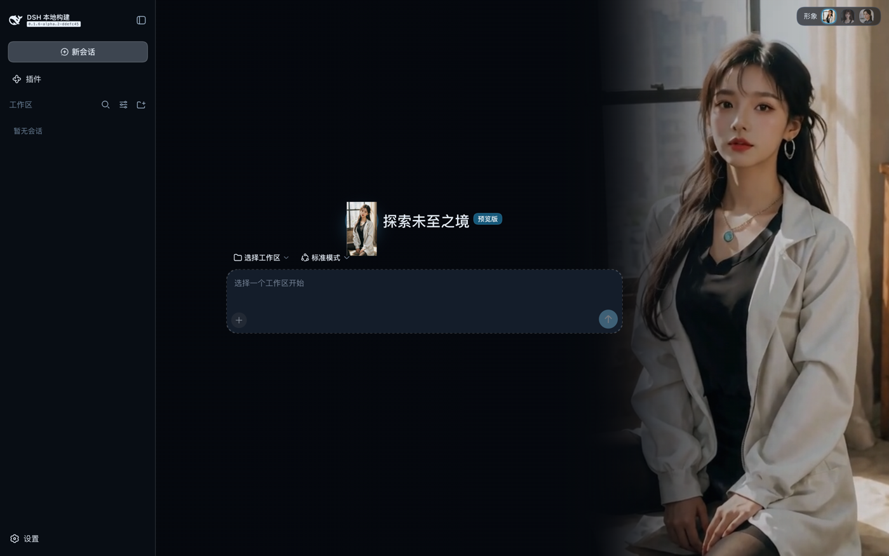

# dsh-assistant-skin

为 DSH（DeepSeek Harness）Web GUI 换上一套「助理皮肤」：**黑蓝暗调主题** + **会话区里的助理形象**（静图 / 无缝循环片段）+ **形象切换** + **常驻与稀有触发的动作调度**。

不改 DSH 源码，以第三方插件形式叠在配置层上，卸载即还原。



## 它做了什么

| 改动 | 落点 | 机制 |
|---|---|---|
| 整套配色 → 黑蓝暗调 | `--dsw-*` 设计令牌（134 个） | `ctx.theme.overrideTokens`，ui-theme 官方的第三方主题扩展点 |
| 强制深色档 | `body[data-ds-dark-theme]` + `color-scheme` | 有六个 DSH 组件不读令牌、只听这个属性；不把它打上，交付物卡片会变成近白底浅字 |
| 会话区背景 → 助理形象 | 注入到会话主区内的媒体层 | 定位主区 → `z-index:-1` 垫层 + 表面转半透明 |
| 正文不压人物 | 主区右侧内边距 = 正文列让位 | 只影响正常流内容；媒体层与控件走 padding box 不受影响 |
| 形象可切换 | 会话区右上角控件 | 形象清单由宿主半**按文件名扫描**下发 |
| 空会话 Hero 形象 | `conversation.hero.brand.mark` 席位 | `slots.register`，`priority:-1` 接管 |

**侧栏品牌位刻意不接管** —— 那里是 DSH 自己的身份（鱼形标识与构建版本），换成助理头像既无信息增量，也让侧栏多了两块要读的文字。

## 它像什么

助理**绝大部分时间处在「常驻」状态**（安静呼吸，几乎不动），动作只是偶尔发生：

```
常驻（呼吸 / 眨眼）
   ├── 待满 40~120 秒 ──┬─ 35% 概率 → 触发一个动作 → 随后回到常驻
   │                    └─ 65% 概率 → 延长这段常驻
   └─ 点击她 → 立即触发一个动作（冷却 1.2 秒）
```

实测分布：**98% 的时间在常驻状态**，动作平均每 **3.5 分钟**一次，且不会连播。这是刻意的设计——一个每隔几秒就换个姿势的助理会持续抢注意力，反而不能用来工作。

## 安装

```sh
# 从 GitHub 装（把 <user> 换成实际用户名）
dsh plugin --profile web add github:<user>/dsh-assistant-skin

# 或者先克隆再以软链安装（改代码即时生效，适合自己改）
git clone https://github.com/<user>/dsh-assistant-skin.git
dsh plugin --profile web add link:./dsh-assistant-skin

# 生效：需要重启
cd ~/deepseek-harness && ./start-web.sh
```

卸载：`dsh plugin --profile web remove dsh-assistant-skin` 后重启。

> **提示**：用 `file:` 安装时 pnpm 会**拷贝**一份而不是软链，改源码不生效。要边改边看就用 `link:`。

## 配置

配置写在 profile 的 patch 层（`~/.dsh/profiles/web/cordis.patch.yml`），也可用 `~/.dsh/dsh-assistant-skin.json` 覆盖：

```yaml
- id: assistant-skin
  config:
    enabled: true
    assistantName: 小汐          # 目前只用于记录；侧栏品牌位已归还 DSH
    assistantTagline: 你的本地 AI 助理
    theme: molan                 # molan(墨蓝) / ouhe(藕荷) / moyu(墨玉) / qingyu(青玉)
```

**形象不在这里列**——宿主半按 `assets/looks/` 的文件名扫描：

```
look-01.jpg              形象 1 的静图（底图 / 片段缺席时的兜底）
look-01.breathe.mp4      形象 1 的某个动作片段（可多动作并存）
look-01.hair.mp4
look-02.jpg
look-02.breathe.mp4
```

丢一个 `look-03.jpg` 进去就多一个形象，丢一个 `look-01.nod.mp4` 就多一个动作，**都不用改代码**。宿主半每次请求现扫清单，所以**刷新页面即可**，不需要重启 dsh。

**片段必须首帧 = 末帧**（同一张图同时作首末帧），否则播到头会弹回起始帧。这条约束还带来一个好处：任意多条片段串接都不跳，因为 A 的末帧 = B 的首帧。

## 换成你自己的形象

1. 把人物图放进 `assets/looks/look-01.jpg`（建议 1500px 宽以上、竖构图、人物偏画面上方）；
2. 重启 dsh，刷新页面——静图就能用了；
3. 想要动起来：用 DSH 的画布工作室插件（`dsh-short-video-studio`）或自己的 ComfyUI 生成循环片段，命名成 `look-01.<动作名>.mp4` 放进去。

动作名只影响排序（`breathe` / `breatheSlow` / `blink` 被当作**常驻**动作，其余都算**会吸引注意力**的动作）。不想要"偶尔动一下"的话，只放常驻片段即可。

## 能力边界（诚实说明）

- **能换**：颜色、质感、圆角、字体、阴影，以及一层自己注入的媒体层与一个 Hero 席位。
- **换不掉**：组件的 DOM 结构与版式。所以「满屏立绘 + 悬浮控件」那种版式做不到 —— 那需要 fork `packages/client/*` 并重建 web 产物。
- **结构性定位**：媒体层要挂进会话主区，而 DSH 的类名是构建期哈希的，所以只能按**计算样式**（`display:grid|flex` 且有两个以上在流宽子元素）来识别主区。**DSH 大改版式时这一处需要重新核对**；找不到时会放弃挂载并留日志，不会崩。

## 排错

| 现象 | 原因 | 处理 |
|---|---|---|
| 改了配置没生效 | 宿主半在进程内存里 | 重启 dsh |
| 改了源码没生效 | 用 `file:` 装的（pnpm 拷贝了一份） | 换 `link:` 重新安装 |
| 有背景但人物位置不对 | 主区定位失败 | 看 dsh 日志里有没有「未定位到会话主区」 |
| 交付物卡片是白底浅字 | `body[data-ds-dark-theme]` 没打上 | 本插件已处理；若你改过主题注册需一并保留 |
| 「重启了但没生效」 | `start-web.sh` 只负责启动、不负责停，端口被旧进程占着，新进程静默退出 | 先停掉占用端口的进程再启动 |

## 许可与素材

- **代码**：[MIT](LICENSE)。
- **形象素材**：静图是 AI 生成的合成人脸（不对应真人）；视频片段由 MiniMax H3 在本地生成。**授权情况与再分发注意事项见 [NOTICE.md](NOTICE.md)**，用于商业用途前请先读那一节。

本项目与 DeepSeek、MiniMax、Comfy Org 均无隶属或背书关系。
